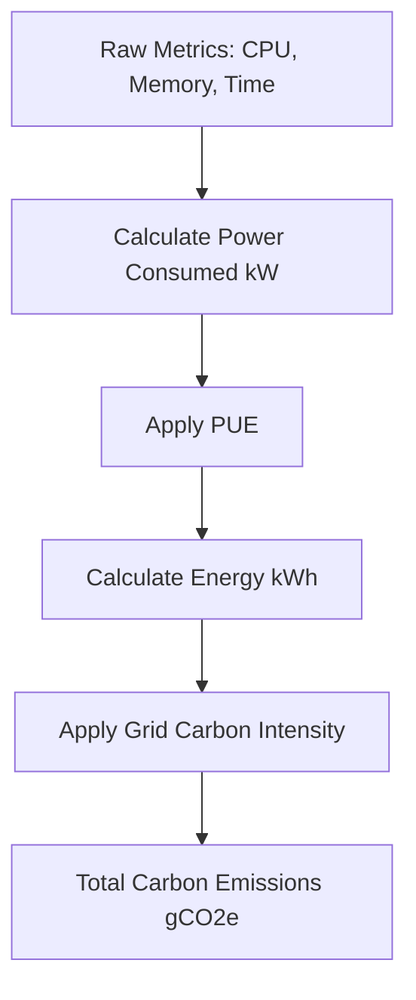
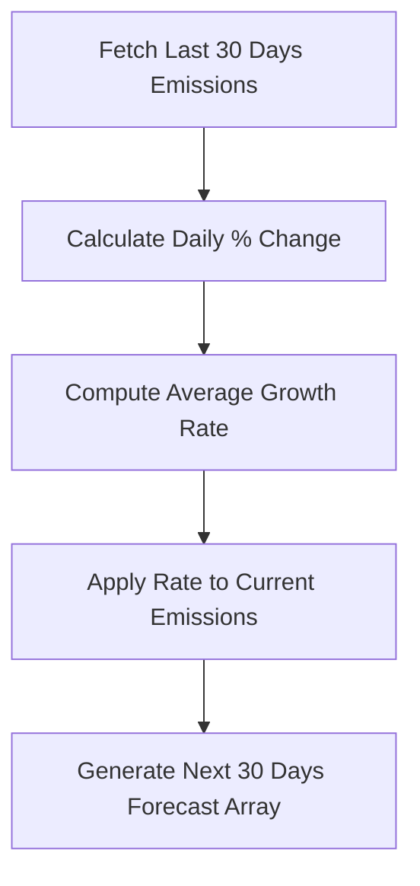
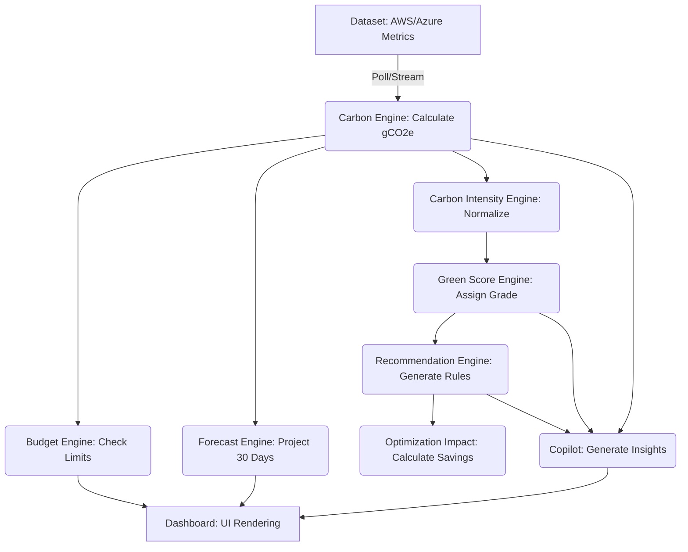

# GreenOps AI Dashboard - ML Design Specification

## 1. Introduction

**Purpose of the ML Layer**
The Machine Learning (ML) Layer of the GreenOps AI Dashboard is designed to transform raw cloud infrastructure metrics into actionable sustainability intelligence. It acts as the brain of the platform, calculating carbon emissions, predicting future usage, and suggesting optimization strategies to reduce environmental impact and costs.

**Responsibilities of the ML Layer**
- Calculate real-time carbon emissions based on resource utilization.
- Forecast future emissions using historical data and trend analysis.
- Generate actionable recommendations for resource optimization.
- Assign Green Scores to infrastructure components.
- Track usage against predefined carbon budgets.
- Provide explainable insights via the GreenOps Copilot.

**Relationship with Other Layers**
- **Data Layer:** The ML layer consumes time-series metrics (CPU, Memory, Network, Power) stored in MongoDB Atlas.
- **Backend Layer (Node.js/Express.js):** The backend serves as an intermediary, querying the ML engines (implemented as modular business logic functions) and exposing the results via REST APIs.
- **Frontend Layer (React/Vite/Chart.js):** Consumes the API endpoints to visualize emissions, forecasts, and recommendations in an interactive dashboard.

---

## 2. Carbon Emission Engine

**Definition**
The Carbon Emission Engine calculates the estimated carbon footprint (in $gCO_2e$) of cloud infrastructure based on power consumption and grid carbon intensity.

**Business Importance**
Provides visibility into the environmental impact of IT operations, enabling companies to report on ESG (Environmental, Social, and Governance) goals and identify high-emission resources.

**Inputs**
- `cpu_usage` (%)
- `memory_usage` (GB)
- `execution_time` (Hours)
- `server_power_rating` (Watts, e.g., 200W for a standard cloud instance)
- `pue` (Power Usage Effectiveness, typical cloud provider PUE is 1.1 - 1.2)
- `grid_carbon_intensity` ($gCO_2e/kWh$)

**Outputs**
- `estimated_carbon_emissions` ($gCO_2e$)

**Formula**
1. **Power Consumed (kW):**
   $$ P = \frac{(\text{cpu\_usage} \times \text{server\_power\_rating}) + \text{memory\_power}}{1000} \times \text{PUE} $$
   *(Simplified for MVP: Assume CPU is the primary power driver)*
2. **Energy Consumed (kWh):**
   $$ E = P \times \text{execution\_time} $$
3. **Carbon Emissions ($gCO_2e$):**
   $$ C = E \times \text{grid\_carbon\_intensity} $$

**Assumptions**
- Linear relationship between CPU usage and power consumption.
- Static PUE based on the cloud provider's published data.
- Average regional carbon intensity.

**Example Calculations**
- CPU Usage: 80%
- Server Rating: 200W
- PUE: 1.1
- Time: 24 Hours
- Grid Intensity: 400 $gCO_2e/kWh$
- Power Consumed = (0.8 * 200 / 1000) * 1.1 = 0.176 kW
- Energy Consumed = 0.176 * 24 = 4.224 kWh
- Carbon Emissions = 4.224 * 400 = 1689.6 $gCO_2e$

**Workflow Diagram**


---

## 3. Carbon Intensity Engine

**Definition**
Measures how efficiently the cloud infrastructure utilizes energy relative to its compute output. It normalizes emissions against business value or workload execution.

**Formula**
$$ \text{Carbon Intensity} = \frac{\text{Total Carbon Emissions (gCO}_2\text{e)}}{\text{Compute Unit (e.g., vCPU Hours or Transactions)}} $$

**Inputs**
- `total_carbon_emissions` ($gCO_2e$)
- `total_vcpu_hours` (or `total_requests_processed`)

**Outputs**
- `carbon_intensity_score` ($gCO_2e$/vCPU-Hour)

**Examples**
- Server A emits 1000 $gCO_2e$ over 100 vCPU-hours. Intensity = 10 $gCO_2e$/vCPU-h.
- Server B emits 1000 $gCO_2e$ over 50 vCPU-hours. Intensity = 20 $gCO_2e$/vCPU-h.
*(Server A is more efficient)*

**Business Value**
Allows fair comparison of sustainability between different teams, projects, or microservices, regardless of their absolute size.

---

## 4. Green Score Engine

**Definition**
A grading system (A to F) that evaluates the sustainability health of a resource or project based on its utilization efficiency and carbon intensity.

**Threshold Logic**
The score is determined by evaluating the `average_cpu_utilization` and `carbon_intensity_score` against predefined benchmarks.

**Scoring Formula**
| Score | Condition (Example Thresholds) | Interpretation |
| :---: | :--- | :--- |
| **A** | CPU Util > 60% AND Intensity < 10 $gCO_2e$/vCPU-h | Highly Optimized, Green |
| **B** | CPU Util > 40% AND Intensity < 15 $gCO_2e$/vCPU-h | Good, Minor Waste |
| **C** | CPU Util > 20% AND Intensity < 20 $gCO_2e$/vCPU-h | Average, Needs Tuning |
| **D** | CPU Util > 10% OR Intensity < 30 $gCO_2e$/vCPU-h | Poor, High Waste |
| **F** | CPU Util < 10% OR Intensity > 30 $gCO_2e$/vCPU-h | Zombie Resource, Critical |

**Examples**
- Resource with 5% CPU usage but running 24/7 gets an **F**.
- Resource with 80% CPU usage in a region with 100% renewable energy gets an **A**.

**Business Interpretation & Management Use Cases**
- **Gamification:** Teams compete to maintain an 'A' grade.
- **Reporting:** C-Level executives can view the overall Green Score of the organization.
- **Alerting:** Automatic notifications when a project drops below a 'C'.

---

## 5. Recommendation Engine

**Purpose:** Identifies actionable steps to reduce carbon footprint and infrastructure costs.

| Rule ID | Trigger Condition | Recommendation | Carbon Impact | Cost Impact | Business Reasoning |
| :--- | :--- | :--- | :--- | :--- | :--- |
| R01 | CPU < 5% for 7 days | Terminate instance | High | High | Zombie instances consume power and budget while providing no value. |
| R02 | CPU < 20% for 7 days | Downsize instance | Medium | Medium | Over-provisioned resources waste energy. Rightsizing aligns capacity with demand. |
| R03 | Memory < 20% for 7 days | Downsize instance memory | Low | Medium | RAM consumes constant power; reducing it saves energy and licensing costs. |
| R04 | Region Intensity > 400 | Migrate to greener region | High | Low | Moving non-latency-sensitive workloads to regions with renewable energy drastically cuts emissions. |
| R05 | High usage outside business hours | Implement auto-scaling/shutdown schedules | Medium | High | Development/Staging environments don't need to run 24/7. |
| R06 | Network egress > 1TB/month | Optimize data transfer / implement CDN | Low | High | Network transfers require energy across multiple hops. Caching reduces load. |
| R07 | Storage > 90% unaccessed | Move to cold storage (e.g., S3 Glacier) | Low | High | Standard block storage requires more active power than archival storage. |
| R08 | Job runtime > 12 hours | Refactor code / use more efficient instances | Medium | Medium | Long-running inefficient scripts consume excess compute cycles. |
| R09 | Instance type is older generation | Upgrade to latest ARM/Graviton instances | Medium | Low | Newer generation processors offer significantly better performance-per-watt. |
| R10 | High idle DB connections | Implement connection pooling | Low | Low | Reduces compute overhead on the database server. |

---

## 6. Forecast Engine

**Requirements**
Provides a lightweight, trend-based projection of future carbon emissions.

**Inputs**
- Historical daily carbon emissions (last 30 days)
- Current carbon budget

**Processing Steps (Trend-Based Forecasting)**
1. **Calculate Daily Growth Rate:** Compute the percentage change in emissions day-over-day for the historical period.
2. **Determine Average Growth:** Find the median or mean of these daily growth rates.
3. **Project Future Days:** Apply the average growth rate to the current day's emissions to project the next 30 days.
   $$ \text{Forecast}_{t+1} = \text{Actual}_{t} \times (1 + \text{Average Growth Rate}) $$

**Outputs**
- Array of projected daily emissions for the next 30 days.
- Projected date of budget exceedance (if applicable).

**Worked Example**
- Day 1: 100g, Day 2: 105g, Day 3: 110.25g.
- Growth Rate: +5% per day.
- Forecast Day 4: 110.25 * 1.05 = 115.76g.

**Forecast Flow Diagram**


---

## 7. Carbon Budget Engine

**Budget Logic**
Similar to financial budgets, organizations set a maximum allowable carbon emission threshold ($gCO_2e$) per month/quarter.

**Threshold Definitions**
- **Safe State (0% - 75% of Budget):** Normal operation. Green dashboard status.
- **Warning State (76% - 90% of Budget):** Alerts generated. Suggests delaying non-critical heavy workloads. Yellow dashboard status.
- **Exceeded State (> 90% of Budget):** Critical alerts. Recommends immediate shutdown of zombie resources. Red dashboard status.

**Business Examples**
- "Project Alpha has a monthly budget of 50kg $CO_2e$. On Day 15, they are at 40kg. The system enters **Warning State** and recommends pausing background data processing jobs until next month."

---

## 8. Optimization Impact Engine

**Purpose**
Quantifies the benefits of applying a recommendation, helping engineers prioritize tasks.

**Carbon Savings Formula**
$$ \text{Carbon Savings} = \text{Current Daily Emissions} - \text{Projected Daily Emissions After Optimization} $$

**Cost Savings Formula**
$$ \text{Cost Savings} = \text{Current Daily Cost} - \text{Projected Daily Cost After Optimization} $$

**Before/After Analysis & Worked Example**
- **Scenario:** Downsizing an over-provisioned server (Recommendation R02).
- **Before:** 8-core server costing $10/day, emitting 500g $CO_2e$/day.
- **Action:** Downsize to 2-core server.
- **After:** Projected cost $2.5/day, emitting 125g $CO_2e$/day.
- **Impact:** Savings of $7.50/day and 375g $CO_2e$/day.

---

## 9. GreenOps Copilot

**Design**
An Explainable Sustainability Assistant based on rule-based logic and templated reasoning to provide context to users without complex LLMs.

**Capabilities**
- Explain emission increases.
- Explain low Green Scores.
- Identify high-emission projects.
- Suggest optimization actions.
- Explain forecast risks.

**Inputs**
- User Context (Project ID)
- Current Metrics & Score
- Active Recommendations

**Reasoning Process (Heuristic-Based)**
1. Check if emissions increased > 10% in the last 24 hours. If yes, map to CPU usage spikes or new instances.
2. Check Green Score. If 'D' or 'F', lookup the primary contributing factor (e.g., low CPU util).
3. Format output into a readable explanation.

**Output Structure**
```json
{
  "insight_type": "explain_score",
  "summary": "Your project scored an 'F' due to high idle time.",
  "details": "Server X has been under 5% CPU for 7 days.",
  "action_link": "/recommendations/R01"
}
```

**Example Conversations**
- **User:** "Why did my emissions spike yesterday?"
- **Copilot:** "I noticed a 20% increase in emissions yesterday. This correlates with a 50% spike in network traffic and 2 new instances spun up in the US-East region. Consider shutting down these instances if the test is complete."

---

## 10. End-to-End Data Flow



**Responsibilities**
- **Dataset:** Source of truth for raw infrastructure metrics.
- **Carbon Engine:** Transforms usage into emissions.
- **Carbon Intensity/Green Score:** Contextualizes emissions into understandable metrics/grades.
- **Forecast/Budget:** Handles future planning and limits.
- **Recommendations/Impact:** Drives actionable change and quantifies ROI.
- **Copilot:** Provides human-readable context.
- **Dashboard:** Visual presentation layer.

---

## 11. API Contracts

**GET /forecast**
```json
{
  "projectId": "p-123",
  "current_trend": "increasing",
  "average_daily_growth_rate": 0.05,
  "forecast_30_days": [
    {"date": "2026-06-06", "projected_gCO2e": 105.0},
    {"date": "2026-06-07", "projected_gCO2e": 110.25}
  ],
  "budget_exceedance_warning": "2026-06-20"
}
```

**GET /green-score**
```json
{
  "projectId": "p-123",
  "score": "C",
  "cpu_utilization_avg": 25.5,
  "intensity_score": 18.2,
  "status": "Needs Tuning"
}
```

**GET /recommendations**
```json
{
  "projectId": "p-123",
  "recommendations": [
    {
      "rule_id": "R01",
      "trigger": "CPU < 5% for 7 days",
      "action": "Terminate instance i-0abc123",
      "impact": {
        "carbon_savings_gCO2e_per_day": 500,
        "cost_savings_usd_per_day": 12.50
      }
    }
  ]
}
```

**GET /budget**
```json
{
  "projectId": "p-123",
  "monthly_budget_gCO2e": 50000,
  "consumed_gCO2e": 42000,
  "percentage_used": 84.0,
  "status": "Warning State"
}
```

**GET /copilot**
```json
{
  "projectId": "p-123",
  "query_context": "general_health",
  "message": "Your project is currently in a Warning State for its carbon budget. I recommend applying 2 pending optimizations to save 500g CO2e per day.",
  "suggested_actions": ["/recommendations"]
}
```

---

## 12. Future Roadmap

**MVP Features (Hackathon Scope)**
- Static PUE and simplified carbon formulas.
- Rule-based Recommendations (CPU thresholds).
- Trend-based linear Forecasting.
- Heuristic-based Copilot responses.
- MongoDB Atlas for data storage.

**Future Features (Post-Hackathon)**
- **Real-Time Monitoring:** WebSockets for live emission tracking.
- **AWS/Azure Integration:** Direct API integration with CloudWatch/Azure Monitor for automated metric ingestion.
- **Advanced Forecasting:** Replace linear trend with ARIMA or LSTM models for seasonality detection.
- **LLM-Based Copilot:** Integrate OpenAI/Gemini APIs to allow users to chat with their infrastructure data naturally.
- **Automated Remediation:** Allow the dashboard to execute API calls to the cloud provider to resize or terminate resources automatically.
